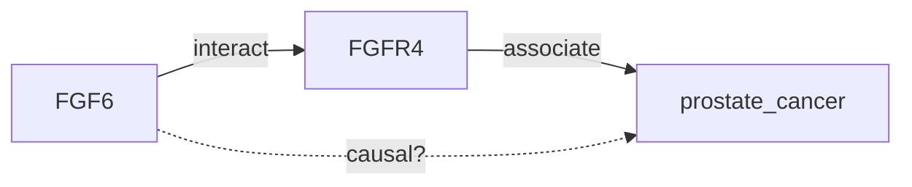
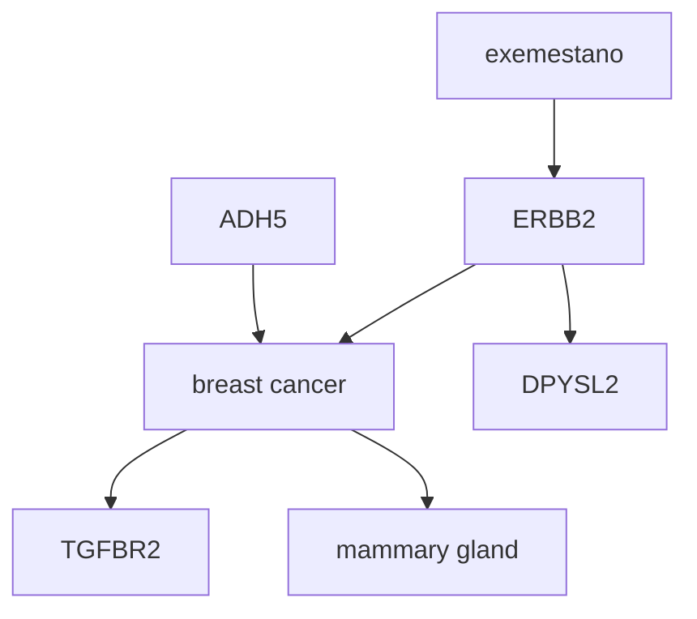
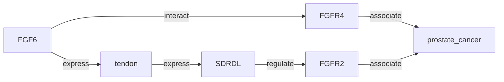

# Knowledge Graph Structure as Prompt: Improving Small Language Models Capabilities for Knowledge-based Causal Discovery

Yuni Susanti1* and Michael Färber2

1 Artificial Intelligence Lab., Fujitsu Ltd., Japan
yuni.susanti@fujitsu.com
2 ScaDS.AI & TU Dresden, Germany
michael.faerber@tu-dresden.de

## Abstract

Causal discovery aims to estimate causal structures among variables based on observational data. Large Language Models (LLMs) offer a fresh perspective to tackle the causal discovery problem by reasoning on the metadata associated with variables rather than their actual data values, an approach referred to as knowledge-based causal discovery. In this paper, we investigate the capabilities of Small Language Models (SLMs, defined as LLMs with fewer than 1 billion parameters) with prompt-based learning for knowledge-based causal discovery. Specifically, we present "KG Structure as Prompt", a novel approach for integrating structural information from a knowledge graph, such as common neighbor nodes and metapaths, into prompt-based learning to enhance the capabilities of SLMs. Experimental results on three types of biomedical and open-domain datasets under few-shot settings demonstrate the effectiveness of our approach, surpassing most baselines and even conventional fine-tuning approaches trained on full datasets. Our findings further highlight the strong capabilities of SLMs: in combination with knowledge graphs and prompt-based learning, SLMs demonstrate the potential to surpass LLMs with larger number of parameters. Our code and datasets are available on GitHub.1

**Keywords:** causal relation · language model · knowledge graph

## 1 Introduction

One of the fundamental tasks in various scientific disciplines is to find underlying causal relationships and eventually utilize them [10]. Causal discovery is a branch of causality study which estimates causal structures from observational data and generates a causal graph as a result. A causal graph, as illustrated in Fig. 1, is a directed graph modeling the causal relationships between observed variables; a node represents a variable and an edge represents a causal relationship.

* This work was conducted during a research stay at KIT and ScaDS.AI/TU Dresden, Germany.
1 https://github.com/littleflow3r/kg-structure-as-prompt
---
2         Y. Susanti and M. Färber

Conventionally, causal discovery involves learning causal relations from observational data by measuring how changes in one variable are associated with changes in another variable, an approach referred to as covariance-based causal discovery [21]. Driven by the recent advancements in LLMs, recent work has explored the causal capabilities of LLMs using metadata (e.g., variable names) rather than their actual data values. In other words, the causal relation is queried in natural language directly to the LLMs. This paper focuses on the latter, and to differentiate with covariance-based causal discovery, we refer to this approach as knowledge-based causal discovery, following the definition of [21].

| smoking |
|----------|
| genetics |
|    ↓     |
|   lung   |
|  cancer  |
|    ↓     |
| coughing |

Fig. 1. Example of a causal graph.

Typically, such metadata-based causal reasoning is performed by Subject Matter Experts (SMEs) as they construct a causal graph, drawing from their expertise in domain-specific subjects and common sense [21], or based on literature surveys on subjects related to the variables. The advancement in LLMs has simplified this formerly challenging process, as LLMs are now capable of providing the knowledge that previously can only be provided by SMEs. Recent works [18,39,42,45] also show promising results, notably, [21] explores causal capabilities of LLMs by experimenting on cause-effect pairs. Their finding suggests that LLM-based methods achieved state-of-the-art performance on several causal benchmarks. Similarly, [45] investigated the causal capability of LLMs by analyzing their behavior given a certain causal question. However, in contrast to [21], their result suggests that LLMs currently lack the capability to offer satisfactory answers for discovering new knowledge. Meanwhile, a work by [18] focused on investigating the LLMs' capability for causal association among events expressed in natural language. Thus, their study is more oriented towards extracting a causal diagram (e.g., a chain of events) from unstructured text instead of discovering new causal relations.

In this paper, we investigate the capabilities of language models for knowledge-based causal discovery between variable pairs given a textual context from text sources. Specifically, given a pair of variables e1 and e2, the task is to predict if a causal relation can be inferred between the variables. Therefore, similar to [18], our focus also lies in inferring causal relations from text rather than discovering new causal relations. In particular, we present "KG Structure as Prompt," a novel approach for integrating structural information from a Knowledge Graph (KG) into prompt-based learning with Small Language Models (SLMs). Prompt-based learning adapts LMs for specific tasks by incorporating prompts—task-specific instruction combined with the text input—to guide the models' output for the downstream tasks. Our approach enhances this method by incorporating additional information from KGs, leveraging the strengths of KGs in providing context and background knowledge. We opted for SLMs because a smaller model that can outperform larger models is more cost-effective and therefore preferable. We conduct experiments on three types of biomedical and an open-
---
KG Structure as Prompt: SLMs for Knowledge-based Causal Discovery            3

domain datasets, and further evaluate the performance of the proposed approach
under three different architectures of language models.
     To summarize, our main contributions are as follows:

1. We present "KG Structure as Prompt", a novel approach for injecting struc-
   tural information from KGs into prompt-based learning. In experiments un-
   der few-shot settings, we demonstrate that our approach outperforms most
   of the no-KG baselines and achieves performance comparable to the conven-
   tional fine-tuning using a full dataset, even with limited samples.
2. We show that our approach is effective with different types of language model
   architectures and knowledge graphs, showcasing its flexibility and adaptabil-
   ity across various language models and knowledge graphs.
3. We demonstrate the robust capabilities of SLMs: fused with prompt-based
   learning and an access to a knowledge graph, SLMs are able to surpass an
   LLM with much larger number of parameters.²

## 2    Background and Related Work

Small Language Models. Small Language Models (SLMs) refer to language
models with fewer parameters, resulting in a reduced capacity to process text
compared to larger-parameter LLMs. However, SLMs typically require less com-
putation resources, making them faster to train and deploy, and maintaining
them is generally more cost-effective. On the contrary, LLMs are trained on vast
amounts of diverse data, thus have significantly more parameters and are capa-
ble of handling more complex language tasks than SLMs. Nevertheless, LLMs
are expensive and difficult to train and deploy as they typically require more
computational resource. For instance, GPT-3 [4], which consists of 175 billion
parameters, is impractical to run on hardware with limited resources.
     In this work, we define SLMs as LMs with less than 1 billion parameters. We
explore the causal capability of SLMs with different architectures: (1) Masked
Language Model (MLM) especially the encoder-only model, (2) Causal Language
Model (CLM) or decoder-only language model, and (3) Sequence-to-Sequence
Language Model (Seq2SeqLM) or encoder-decoder model. We provide an overview
of each type of architecture below.
     MLMs, especially encoder-only models such as BERT [8], are a type of LM
that utilizes encoder blocks within the transformer architecture and are trained
to predict masked tokens based on the context provided by surrounding words.
They excel in natural language understanding (NLU) tasks, e.g., text classifica-
tion, as they are able to capture relationships between words in a text sequence.
CLMs, such as GPT-3 [4], use the decoder blocks within the transformer archi-
tecture and are trained to generate text one token at a time, by conditioning
each token on the preceding tokens in the sequence. Meanwhile, Seq2SeqLMs,
such as T5 [32], consist of both encoder and decoder blocks. The encoder trans-
forms the input sequence into vector representation, while the decoder produces

² GPT-3.5-turbo model [31] with ICL [4] prompting method
---
4         Y. Susanti and M. Färber

the output based on the encoded vector. CLMs and Seq2SeqLMs generally work
well for natural language generation (NLG) and NLU tasks such as translation
and summarization, as they can produce coherent and grammatically accurate
sentences. We list our choice of language models in §5.

## Prompt-based Learning & Knowledge Injection

Research on classifying causal relations from text has predominantly occurred within supervised
settings, utilizing classical machine learning (ML) approaches [3,5,6,19,20,28]
or fine-tuning pre-trained language models [11,18,36,33,38]. Classical ML techniques often require extensive feature engineering and have shown inferior performance compared to fine-tuning language models such as BERT [8]. Therefore,
we evaluate our method against fine-tuning methods as baselines.

Meanwhile, prompt-based learning, also known as prompt-tuning, has recently emerged as a promising alternative to the conventional fine-tuning approach for a variety of Natural Language Processing (NLP) tasks [1,26,34,35].
Typically, a prompt is composed of discrete text (hard prompt); however, recent
work has introduced soft prompt, a continuous vector that can be optimized
through backpropagation [23,25]. In the relation classification task, promptbased learning often involves inserting a prompt template containing masked
tokens into the input, essentially converting the task into masked language modeling or text generation problems [7,13,14]. This approach is particularly wellsuited for few-shot or zero-shot scenarios, where only limited labeled data is
available [9,35]. This motivates us to investigate such prompt-based learning
under few-shot settings, given the scarcity of datasets for our causal relation
classification task.

Other works explore knowledge injection for the prompt construction, for
instance, KnowPrompt [7] injects latent knowledge contained in relation labels
into prompt construction with learnable virtual words. KAPING [2] retrieves
top-K similar triples of the target entities from Wikidata and further augments
them as a prompt. KiPT [24] uses WordNet to calculate semantic correlation
between the input and manually constructed core concepts to construct the
prompts. Our work differs from them since we focus on leveraging structural
information of knowledge graphs to construct the prompt (see §4).

## 3 Task Formulation

In this work, we focus on pairwise knowledge-based causal discovery: given a
pair of entities e1 and e2, i.e., variable or node pairs such as FGF6 and prostate
cancer, the task is to predict if a causal relation can be inferred between the pair.
We formulate the task as a binary classification task, classifying the relation as
causal or non-causal. We evaluate our approach on a dataset D = {X , Y}, where
X is a set of training instances and Y = {causal, non-causal} is a set of relation
labels. Each instance x ∈ X consists of a token sequence x = {w1, w2, ...w|n|}
and the spans of a marked variable pair, and is annotated with a label yx ∈ Y.
---
# KG Structure as Prompt: SLMs for Knowledge-based Causal Discovery

Figure 2

**Fig. 2. Overall framework of our KG Structure as Prompt with prompt-based learning**

## 4 Approach

We illustrate our proposed approach in Fig. 2. First, we generate a graph context, which is derived from the structural information of a knowledge graph with our KG Structure as Prompt method. Next, we feed the generated graph context and the inputs, i.e., the variable pair and its textual context, into the SLMs to train a prompt-based learning model.

We elaborate our proposed approach in the following subsections. We start with preliminaries (§4.1), followed by the design of the KG structure as Prompt for generating the graph context (§4.2), and the incorporation of the generated graph context into the SLMs architecture with prompt-based learning (§4.3).

### 4.1 Preliminaries

Formally, we define a directed graph G = (V, E) where V is a set of vertices or nodes, and E ⊆ V × V is a set of directed edges. A knowledge graph is a specific type of directed graph representing a network of entities and the relationships between them. Formally, we define a knowledge graph as a directed labeled graph KG = (N, E, R, F) where N is a set of nodes (entities), E ⊆ N × N is a set of edges (relations), R is a set of relation labels, and F : E → R, is a function assigning edges to relation labels. For instance, assignment label r to an edge e = (x, y) can be viewed as a triple (x, r, y), e.g., (Tokyo, IsCapitalOf, Japan).

### 4.2 Knowledge Graph Structure as Prompt

In the field of Graph Neural Networks (GNNs), [44] explores whether LLMs can replace GNNs as the foundation model for graphs by using natural language to describe the geometric structure of the graph. Their results on several graph datasets surpass traditional GNN-based methods, showing the potential
---
6         Y. Susanti and M. Färber

of LLMs as a new foundational model for graphs. Inspired by their success, we
similarly leverage the structural information of a specific type of graph, i.e., a
knowledge graph, to infer causal relationships between variable pairs. We select
knowledge graphs due to their rich structured information and their capability to express interconnected relationships. We call our approach "Knowledge
Graph Structure as Prompt".

For instance, we may infer a causal relationship by looking at multi-hop
relations between a node pair in a knowledge graph, as illustrated in Fig. 3.

Fig. 3. Illustration of inferring a causal relationship in KG.

In Fig. 3, the node FGF6 is indirectly connected to the node prostate cancer
within one hop via the node FGFR4. As verified by a human expert, there is indeed
a causal relation between the nodes FGF6 and prostate cancer. We argue that
such graph structural information, in this example a path, adds background
knowledge on top of internal knowledge of LMs, effectively assisting LMs in
inferring causal relation between the variable pair. Specifically, we aim to use a
natural language description of the structural information from the knowledge
graph to be used as a prompt for prompt-based learning. We refer to such a
description of knowledge graph structure as a graph context.

In this work, we specifically examine three kinds of vital structural information of a KG to be used as the graph context, namely (1) neighbor nodes,
(2) common neighbor nodes, (3) metapath, described in detail as follows.

(1) Neighbor Nodes (NN). The essence of GNNs lies in applying different
aggregate functions to the graph structure, i.e., passing node features to neighboring nodes, where each node aggregates the feature vectors of its neighbors
to further update its feature vector. Thus, it is evident that the neighbor nodes
are the most crucial feature within a graph. Inspired by that, we examine the
neighboring nodes of the target node pairs to infer their causal relationship.

Formally, a node x is a neighbor of a node y in a knowledge graph KG =
(V, E) if there is an edge {x, y} ∈ E. We provide an example of neighbor nodes
from Wikidata [40] in Fig. 4. According to the provided example, the node
prostate cancer has urology as one of its neighbor nodes, while FGF6 has
urinary bladder as one of its neigbors. Thus, it is likely that a connection
exists between the node pair (FGF6, prostate cancer) due to their respective
neighboring nodes: urinary bladder ↔ urology.
---
KG Structure as Prompt: SLMs for Knowledge-based Causal Discovery                       7

| gene | FSHR |
|------|------|
| homo sapiens | urinary bladder | F6F10 |
| FGF6 | urology | prostate cancer |
| exocrine gland | human chromosom12 | cabazitaxel |
| | | nilutamide |

Fig. 4. Example of neighbor nodes for FGF6 (left) and prostate cancer (right).

For utilizing the neighbor nodes structure in the prompt, we describe it in
natural language to form a graph context C, which we formally denote as:

$$C(x, V, E) = \{x\} \text{"is connected to"} \{[x_2]_{x_2 \in V_x^2}\}$$           (1)

We also create a variation of C where we include the edge description/relation
labels E, formally denoted as follows:

$$C(x, V, E) = \{x\} \text{"has"} \{E_{x,x_2}\} \text{"relation with"} \{[x_2]_{x_2 \in V_x^2}\}$$    (2)

where $V_x^k$ represents the list of node x's k-hop neighbor nodes and $E_{x,x_2}$
represents the relation or edge description between the node x and its neighbor
nodes. The additional template words such as "is connected to" and "has relation
with" are optional, and can be replaced by any other fitting words. Then, with
Eq. 1, the generated graph context C for the node prostate cancer in Fig. 4
is shown in the following Example 1.

Example 1. prostate cancer is connected to nilutamide, cabazitaxel, urology,
FSHR, F6F10

When including the relation labels (Eq. 2), the graph context would be:

Example 2. prostate cancer has drug or therapy used for treatment relation
with nilutamide and cabazitaxel, has genetic association with FSHR and F6F10

(2) Common Neighbor Nodes (CNN). Unlike neighbor nodes, common
neighbor nodes capture the idea that the more neighbors a pair of nodes
(x, y) shares, the more likely it is for the pair to be connected, i.e., there exists
an edge e = x, y between them. We argue that common neighbors between
two nodes help infer their relationship, so we examine the common neighbors
information between the node pair as graph context, as well. Fig. 5 shows an
example of common neighbor nodes for the pair (breast cancer, ERBB2), taken
from Hetionet knowledge graph [17]. According to the provided example, the pair
has in total 95 common neighbors, confirming a close relationship between them.

Formally, common neighbors between the nodes x and y can be defined as:

$$CN\{x, y\} = N(x) \cap N(y)$$                                (3)
---
8        Y. Susanti and M. Färber

Fig. 5. Example of common neighbor nodes for the pair (ERBB2, breast cancer).
Different colors of the nodes represent different node types.

where N(x) is the set of nodes adjacent to node x (the neighbors of x), and
N(y) is the set of nodes adjacent to node y (the neighbors of y). Subsequently,
the graph context C for describing the common neighbors between the pairs x
and y can be formed as follows:

C(x,CN, y) = "Common neighbor nodes of {x} and {y} are" : {[n]n∈CN}   (4)

where CN represents the list of common neighbor nodes of the pair x and y as
defined in Eq. 3. Again, the additional template words "Common neighbor nodes
of..." are optional and can be replaced by other words. Then, we can generate
the graph context C including the common neighbor nodes information for the
pair in Fig. 5, as follows:

Example 3. Common neighbor nodes of breast cancer and ERBB2 are: ADH5,
mammary gland, exemestane, TGFBR2, DPYSL2

(3) Metapath (MP). Metapaths, or meta-paths are sequences of node types
which define a walk from an origin node to a destination node [37]. The term
"metapath" in this work is borrowed from the biomedical domain, referring to
specific node type combinations thought to be informative [30]. Due to its im-
portance in biomedical network analysis [41,43], we investigate the metapaths
of two nodes for inferring their causal relationship. Moreover, causal relation-
ships are frequently observed in the biomedical domain. Fig. 6 shows examples
of metapaths of the pair prostate cancer and FGF6.

Formally, a metapath MP can be defined as a path Z1 --R1--> Z2 --R2--> ... --Rn-->
Zn+1 describing a relation R between node types Z and Zn+1. The following
examples illustrate metapaths of different path length n from Fig. 6.

MP = (FGF6, FGFR4, prostate cancer), composed of node types {gene,
gene, disease}, with n = 3

MP = (FGF6, tendon, SDRDL, FGFR2, prostate cancer), composed
of node types {gene, anatomy, gene, gene, disease}, with n = 5
---
KG Structure as Prompt: SLMs for Knowledge-based Causal Discovery                      9

Fig. 6. Example of metapaths for the pair (FGF6, prostate cancer). Different colors of the nodes represent different node types.

As explained by the example provided in Fig. 3, we argue that an indirect path between two nodes can be useful for inferring a causal relation between two pairs, even when the edge itself does not describe a causal relation. Thus, an indirect metapath, or combination of meaningful node types could be latent evidence of causality between a pair of variables. We describe the metapath structure from KG in natural language to form a graph context C, as follows:

$$C(x, y, MP\{V, E\}) = \{x\} \text{"is connected to"} \{y\} \text{"via the following path: "}\{v\} \{E_{v,v2}\} \{v2\}$$

(5)

where MP{V, E} is a metapath MP with length n containing a set of nodes V (v1, v2, ...v|n|) and a set of edges E(v1, v1+n). Additional tokens "is connected to..." are optional and can be replaced by other tokens. Then, the graph context C with metapath information for the example in Fig. 6 would be:

Example 4. FGF6 is connected to prostate cancer via the following paths: FGF6 expressed in tendon, tendon expresses SQRDL, FGFR2 regulates SQRDL, FGFR2 associates with prostate cancer

To prevent bias in prediction by the LMs, we avoid the direct path. For instance, for the pair (x, y), we avoid the path MP = (x, y) and MP = (y, x), when such path exists in the KG.

### 4.3 Prompt-based learning with graph context

As illustrated in the model architecture in Fig. 2, we feed the textual context into SLMs together with the graph context generated with KG Structure as Prompt. We further design a prompt-based learning approach utilizing both contexts elaborated in this section. To get a clear distinction between conventional fine-tuning and our proposed prompt-based learning approach, we first provide a short overview of the conventional fine-tuning approach, as follows.

Given a pre-trained LM L to fine-tune on a dataset D, the conventional fine-tuning method encodes the training sequence x = {w1, w2, ...w|n|} into the corresponding output hidden vectors of the LMs h = {h1, h2, ...h|n|}. For MLMs such as BERT [8], the special token "[CLS]" is inserted at the beginning
---
10          Y. Susanti and M. Färber

of the sequence, and this special token is used as the final sequence represen-
tation h′, since it is supposed to contain information from the whole sequence.
A fully-connected layer and a softmax layer are further applied on top of this
representation to calculate the probability distribution over the class set Y, as
follows.

$$p = softmax(W_f h' + b_f)$$                (6)

Prompt-based learning, on the other hand, adapts the pre-trained LMs
for the downstream task via priming on natural language prompts−pieces of
text that are combined with the input and fed to the LMs to produce an output
for downstream tasks [1]. Concretely, we first convert each input sequence x with
a template T to form a prompt x′: T : x 7→ x′. In addition, a mapping func-
tion M is used to map the downstream task class set Y to a set of label words
V constituting all vocabularies of the LM L, i.e., M : Y 7→ V. As in the pre-
training of LMs, we further insert the special token "[MASK]" into x′ for L to fill
with the label words V. We provide an example of the prompt formulation below.

Given x ="Smoking causes cancer in adult male.", we set a template T , e.g.,

T = [x] "It shows [MASK] relation."

Then, the prompt x′ would be:

x′ = "Smoking causes cancer in adult male. It shows [MASK] relation."

We further feed the prompt x′ into L to obtain the hidden vector h[MASK]
of [MASK]. Next, with the mapping function M connecting the class set Y and
the label words, we formalize the probability distribution over Y at the masked
position, i.e., p(y|x) = p([MASK] = M(y)|x′). Here, the mapping function can
also be set manually e.g., M(true) = "causal" and M(f alse) = "non-causal".
Note that depending on the task, dataset, and the prompt design, the class labels
themselves can be used directly without any mapping function M.

In this study, our prompt-based learning combines the input sequence x with
the graph context C into the prompt x′, as illustrated in Fig. 2. Specifically, we
formulate the prompt x′ to include the following elements:

(1) textual context: input sequence x containing the pair,
(2) graph context C: context generated from KG structures as described in §4.2,
(3) target pair: pair e1 and e2 as the target, e.g., (FGF6, prostate cancer),
(4) [MASK] token,
(5) (optional) template tokens.

Subsequently, our final prompt x′ as the input to the LM for the pair e1 and
e2 can be formally defined as:

x′ = [x] [C] The pair [e1] and [e1] shows a [MASK] relation.       (7)

In this study, we select three SLMs, one for each of the three architectures:
MLM, CLM, Seq2SeqLM. Since each type of SLMs is trained differently, we de-
sign the prompt x′ differently across each type of SLMs. For instance, the prompt
---
KG Structure as Prompt: SLMs for Knowledge-based Causal Discovery              11

x′ in Eq. 7, which is a cloze-style task prompt, suits the MLM architecture, since
this model is trained to be able to see the preceding and succeeding words in
texts. As for CLM and Seq2SeqLM, we cast the task as a generation-type, with
prompt x′ such as:

x′ = [x] [C] The pair [e1] and [e2] shows a causal relation: [MASK].       (8)

As mentioned earlier, the design of the mapping function M to map the
output into the downstream task labels varies depending on the task, dataset,
and the prompt design. For instance, with the prompt x′ as in Eq. 7, we can
directly use the class labels set Y = {causal, non-causal} without any mapping
function. Meanwhile, for prompt x′ in Eq. 8, we manually define a mapping
function, e.g., M(causal) = "true" and M(non-causal) = "f alse". Note that
the template "The pair shows..." is optional and can be replaced with other text.

## 5 Evaluation

Experiment Settings. We evaluate the proposed approach under few-shot
settings, using k = 16 training samples across all experiments. Precision (P),
Recall (R), and F1-score (F1) metrics are employed to evaluate the performance.
Since fine-tuning on low resources often suffers from instability and results may
change given a different split of data [35], we apply 5-fold cross-validation and
the metric scores are averaged. We restrict the number of contents from the KG
structures to be included in the prompt since the length of the prompt for SLMs
is limited, and we restrict the number of hops when querying the KG, as well. We
experimented with different settings and reported the best performing models.
Additional technical details are provided online as supplementary materials.

Datasets. The evaluation datasets are summarized in Table 1. Causality is often
observed in the biomedical domain, thus we primarily evaluate our approach
within this field, supplemented by an open-domain dataset. Each instance in the
dataset comprises textual context where a variable pair co-occurs in a text (see
Example 5 & 6), and is annotated by human experts to determine if there is a
causal relation between the variables.

Example 5. FGF6 contributes to the growth of prostate cancer by activating...

Example 6. The deadly train crash was caused by a terrorist attack.

Choice of SLMs. In this work, we define SLMs as LMs with less than 1
billion of total parameters. We experimented with SLMs with three different
architectures, as follows.

(a) MLM: roberta [27] model adapted to the biomedical domain, with 125 mil-
    lion parameters (biomed-roberta-base-125m [12]),
(b) CLM: bloomz-560m [29] with 560 million parameters,
(c) Seq2SeqLM: T5-base-220m [32] model with 220 million parameters
---
12        Y. Susanti and M. Färber

Table 1. Dataset sizes and types.

| dataset                               | domain       | total instances | description               |
|---------------------------------------|--------------|-----------------|---------------------------|
| GENEC (ours)                          | biomedical   | 789             | gene-gene causality       |
| DDI [16]                              | biomedical   | 33,508          | drug-drug causality       |
| COMAGC [22]                           | biomedical   | 820             | gene-disease causality    |
| SEMEVAL-2010 Task 8 [15]              | open-domain  | 10,717          | general domain causality  |

Choice of KGs. We selected the following two KGs for the experiments:

(a) Wikidata [40], as a representation of the general-domain KG,
(b) Hetionet [17], a domain-specific KG assembled from 29 different databases,
    covering genes, compounds, and diseases.

We selected Wikidata for its broad coverage of numerous subjects and topics. As
a comparison, we selected biomedical-KG Hetionet since we primarily evaluate
our approach on the datasets from this particular domain.

Model Comparison. We compare the following models: Models (1) to (4) rep-
resent the models trained without the graph context, i.e., the baselines, while
models marked with "PBL" (model 5 to 7) are our proposed prompt-based learn-
ing method injected with graph context information from KGs.

(1) ICL: In-Context Learning refers to a prompting method where few demon-
    strations of the task are provided to the LLMs as part of the prompt [4]. For
    this method, we selected GPT-3.5-turbo-instruct model by OpenAI, and
    provided k = 16 samples as demonstrations to query the model.
(2) FTfull: Conventional Fine-Tuning models trained using the full datasets.
(3) FTfew-shot: Conventional Fine-Tuning models under few-shot k = 16 setting.
(4) PTfew-shot: Original Prompt Tuning [23] as a baseline, which is essentially
    prompt-based learning without any graph context.
(5) PBLNN-Wiki-few-shot: Our proposed Prompt-based Learning + KG Structure
    as Prompt using the neighbor nodes NN structure from Wikidata.
(6) PBLCNN-Het-few-shot: Our proposed Prompt-based Learning + KG Structure
    as Prompt using the common neighbor nodes CNN structure from Hetionet.
(7) PBLMP-Het-few-shot: Our proposed Prompt-based Learning + KG Structure
    as Prompt using the metapaths MP structure from Hetionet.

Some variants of the proposed approach, such as PBLMP-Wiki-few-shot, were
omitted due to the computational expense of multi-hop querying in Wikidata,
which often results in no usable metapaths for many pairs. In addition, to focus
the discussion on the more effective models, we have omitted the results of less
effective models, such as PBLNN-Het-few-shot. We provide the more complete re-
sults, including zero-shot prompting and classical ML experiment results, online
as supplementary materials.
---
KG Structure as Prompt: SLMs for Knowledge-based Causal Discovery                                  13

## 6 Results and Discussion

Table 2 & 3 summarize the results. We report the averaged Precision (P), Recall (R), and F1 scores, including the standard deviation values of the F1 scores over the 5-folds cross-validation. We provide a summary of the primary findings (§6.1), followed by analysis and discussion of the results (§6.2).

Table 2. Evaluation results on biomedical-domain datasets. Values in parenthesis are the standard deviations of F1 scores over 5-cv test folds. NN, CNN, MP indicate the KG structures used as graph context: neighbors nodes, common neighbors nodes, and metapath, respectively. bold: highest F1 scores per LMs architecture and per dataset, underline: F1 scores of the highest-performed models per dataset.

| | COMAGC | | | GENEC | | | DDI | | |
|---|---|---|---|---|---|---|---|---|---|
| | P | R | F1 | P | R | F1 | P | R | F1 |
| (baseline) ICL(GPT-3.5-turbo) | 64.1 | 67.7 | 65.5(.18) | 55.4 | 77.2 | 62.6(.16) | 53.2 | 99.0 | 68.9(.08) |
| *MLM architecture (biomed-roberta-base-125m)* | | | | | | | | | |
| FTfull | 90.0 | 86.8 | 88.2(.02) | 61.0 | 61.0 | 61.5(.03) | 84.0 | 98.9 | 90.7(.04) |
| (baseline) FTfew-shot | 87.0 | 71.0 | 76.8(.02) | 52.0 | 52.0 | 52.0(.02) | 64.9 | 87.0 | 73.9(.07) |
| (baseline) PTfew-shot | 87.0 | 77.2 | 80.6(.03) | 58.0 | 58.0 | 58.0(.02) | 69.6 | 83.0 | 75.4(.03) |
| (ours) PBLNN-Wiki-few-shot | 82.0 | 85.0 | 83.5(.02) | 63.0 | 63.0 | 63.0(.03) | 70.2 | 85.0 | 76.6(.03) |
| (ours) PBLCNN-Het-few-shot | 77.4 | 89.5 | 82.7(.05) | 54.5 | 54.4 | 54.4(.02) | 65.1 | 89.9 | 74.6(.05) |
| (ours) PBLMP-Het-few-shot | 80.0 | 89.3 | 83.9(.03) | 60.5 | 60.5 | 60.5(.02) | 67.0 | 87.6 | 75.4(.02) |
| *CLM architecture (bloomz-560m)* | | | | | | | | | |
| FTfull | 58.0 | 91.8 | 71.3(.07) | 53.8 | 73.0 | 60.7(.07) | 83.0 | 91.4 | 86.7(.06) |
| (baseline) FTfew-shot | 73.4 | 85.0 | 77.6(.04) | 48.2 | 86.0 | 61.7(.01) | 72.0 | 61.5 | 66.1(.04) |
| (baseline) PTfew-shot | 64.1 | 95.0 | 76.3(.01) | 51.3 | 97.0 | 67.6(.01) | 60.2 | 92.0 | 72.7(.02) |
| (ours) PBLNN-Wiki-few-shot | 71.7 | 90.9 | 79.0(.02) | 54.1 | 90.0 | 67.4(.01) | 63.3 | 88.0 | 72.6(.02) |
| (ours) PBLCNN-Het-few-shot | 65.7 | 94.7 | 77.2(.05) | 52.8 | 100 | 69.1(.00) | 60.4 | 93.9 | 72.8(.05) |
| (ours) PBLMP-Het-few-shot | 76.9 | 89.0 | 81.8(.04) | 52.8 | 91.0 | 68.5(.03) | 65.5 | 90.8 | 74.8(.05) |
| *Seq2SeqLM architecture (T5-base-220m)* | | | | | | | | | |
| FTfull | 88.5 | 78.0 | 82.6(.07) | 60.6 | 43.0 | 50.0(.11) | 96.3 | 83.0 | 88.8(.04) |
| (baseline) FTfew-shot | 68.8 | 81.0 | 72.7(.06) | 48.3 | 67.0 | 55.5(.01) | 55.6 | 94.0 | 69.6(.04) |
| (baseline) PTfew-shot | 64.5 | 91.0 | 75.0(.05) | 63.0 | 83.0 | 69.3(.06) | 63.3 | 82.0 | 70.3(.04) |
| (ours) PBLNN-Wiki-few-shot | 65.3 | 90.0 | 74.7(.01) | 66.5 | 76.0 | 70.3(.02) | 57.5 | 95.0 | 70.9(.03) |
| (ours) PBLCNN-Het-few-shot | 65.4 | 86.3 | 73.4(.02) | 56.0 | 95.8 | 70.6(.01) | 56.2 | 96.0 | 70.6(.02) |
| (ours) PBLMP-Het-few-shot | 73.3 | 82.0 | 75.6(.03) | 56.5 | 91.0 | 69.7(.02) | 60.6 | 92.9 | 72.9(.03) |

### 6.1 Primary Findings

We listed the summary of the main results from Table 2 below.
---
14        Y. Susanti and M. Färber

Table 3. Evaluation results for open-domain dataset: SEMEVAL-2010 Task 8

| | P | R | F1 | P | R | F1 | P | R | F1 |
|---|---|---|---|---|---|---|---|---|---|
| (baseline) ICLGPT-3.5-turbo | 52.2 | 97.2 | 67.5(.07) | | | | | | |
| | MLM | | | CLM | | | Seq2SeqLM | | |
| FTfull | 94.8 | 88.7 | 91.6(.02) | 73.0 | 74.0 | 71.3(.07) | 82.8 | 77.0 | 79.4(.02) |
| (baseline) FTfew-shot | 57.2 | 83.0 | 67.2(.04) | 50.2 | 99.0 | 66.6(.01) | 52.1 | 90.9 | 61.1(.04) |
| (baseline) PTfew-shot | 51.9 | 94.0 | 66.9(.00) | 51.7 | 98.0 | 67.6(.02) | 52.5 | 93.0 | 66.7(.02) |
| (ours) PBLNN-Wiki-few-shot | 55.7 | 93.0 | 69.7(.01) | 53.4 | 91.2 | 67.4(.00) | 53.7 | 93.0 | 67.9(.01) |

(a) Our proposed approach outperforms the no-graph context baseline models,
    in most of the experiments across different dataset domains: up to 15.1 points
    of improvement of F1 scores on biomedical datasets (55.5 → 70.6, GENEC
    dataset) and 6.8 points of improvement on open-domain dataset (61.1 →
    67.9, SEMEVAL dataset).
(b) Under few-shot settings with k = 16 training samples, our proposed approach
    generally achieves the second-best performance compared to FTfull model,
    which is the conventional fine-tuning models trained with full datasets. Few
    even surpassed them, such as PBLNN-Wiki-few-shot model with MLM architecture (63.0 vs. 61.5) and PBLCNN-Het-few-shot model with CLM architecture,
    on GENEC dataset (69.1 vs. 60.7).
(c) Our models based on SLMs with less that 1 billion parameters surpassed the
    ICL prompting method on much larger model across all datasets in most
    experiments, underlining the importance of KGs to support the constrained
    internal knowledge of smaller LMs.

## 6.2 Analysis and Discussion

### NN vs. CNN vs. MP
In our experiments, the KG structure metapath
MP contributed the most to the top-performing models, while the neighbors
nodes NN and common neighbors nodes CNN roughly exhibited comparable
performance across models and datasets. The effectiveness of MP likely depends on the hop count between entity pairs in the dataset, i.e., the hop count is
relatively high (2.8) for the COMACG dataset, where MP gave the best performance. Conversely, for the GENEC dataset, where the average MP hop is low
(1.8), CNN and NN outperformed MP. To train a robust model that is able
to generalize well given any KG structure, we opted to not optimize the content
selection of the KG structures in the current experiments. For instance, when
there are more than m metapaths for a pair, we randomly select m of them, m
being a hyperparameter of the number of metapaths to be included as prompt.
In spite of that, our proposed approach achieved a relatively satisfactory performance, suggesting that rather than the content of the structure, the type of
the structural information, i.e., NN vs. CNN vs. MP, is arguably more
important based on the experiments.
---
## KG Structure as Prompt: SLMs for Knowledge-based Causal Discovery            15

### MLM vs. CLM vs. Seq2SeqLM. 
For classification tasks, language models trained with MLM architecture are often preferred. This preference comes from the fact that MLMs are trained to consider both preceding and succeeding words, a crucial aspect for accurately predicting the correct class in a classification model. In line with this, the top-performing models trained on both full and few-shot datasets are based on the MLM architecture. The second best-performing models using full dataset are based on the Seq2SeqLM architecture, followed by those based on the CLM architecture. This is most likely because, similar to MLMs, Seq2SeqLMs also include encoder blocks and are trained to recognize the surrounding words [32]. However, this trend slightly differs in experiments under few-shot settings, as the models based on CLM architecture outperformed those based on Seq2SeqLM architecture. Thus, selecting an appropriate architecture, specifically how the LMs are trained, is crucial when adapting the LMs for downstream tasks. As demonstrated by the outcomes of our experiments, LMs trained with the MLM architecture are generally more suitable for classification tasks than those with Seq2SeqLM and CLM architectures.

### Wikidata vs. Hetionet. 
In the biomedical domain, the proposed approach injected with structural information from Hetionet demonstrates better performance in most experiments. This is expected considering the domain-specific nature of the dataset. Nevertheless, both Wikidata and Hetionet performed relatively well; the top-performing models for COMAGC and GENEC datasets are attained with Hetionet, while for DDI dataset are achieved with Wikidata. We also achieved 6.8 points of F1 score improvement on SEMEVAL dataset with Wikidata. This suggests that the proposed approach is rather flexible regarding the choice of KGs.

### SLMs vs. LLMs. 
We selected OpenAI's GPT-3.5-turbo-instruct [31] as a representative of larger parameter-LLMs. However, OpenAI does not provide technical details such as the numbers of parameters; except the context windows which is 4,096 tokens in size for this model [31]. This is much larger than our choice of SLMs with a maximum token length ranging from 128 to 512. To summary, the results demonstrate that the SLMs outperformed this model across all datasets in most experiment. This further shows the potential of SLMs: combined with prompt-based learning and access to KGs, the proposed approach outperforms LLMs with considerably larger size and parameters, with minimal training effort (few-shot). Note that we also provided k = 16 training samples as task demonstration to query the GPT model for a more fair comparison with the experiments under few-shot settings.

Typically, SLMs are trained on significantly less data compared to LLMs, which leads to reduced capacity and inferior performance in downstream tasks. Therefore, the graph context derived from the structural information of KG by our proposed KG Structure as Prompt approach effectively serves as an additional evidence of causality; in other words, it assists the SLMs to rely
---
16        Y. Susanti and M. Färber

not only on their constrained internal knowledge, but also by enhancing their
capacity through denser information sourced from the KGs.

## 7     Conclusion

In this paper, we presented "KG Structure as Prompt", a novel approach for
integrating structural information from KGs into prompt-based learning, to further enhance the capability of Small Language Models (SLMs). We evaluated
our approach on knowledge-based causal discovery tasks. Extensive experiments
under few-shot settings on biomedical and open-domain datasets highlight the
effectiveness of the proposed approach, as it outperformed most of the no-KG
baselines, including the conventional fine-tuning method with a full dataset. We
also demonstrated the robust capabilities of SLMs: in combination with prompt-
based learning and KGs, SLMs are able to surpass a language model with larger
parameters. Our proposed approach has proven to be effective with different
types of LMs architectures and KGs, as well, showing its flexibility and adaptability across various LMs and KGs.

Our work has been centered on discovering causal relationships between pairs
of variables. In future work, we aim to tackle more complex scenarios by developing methods to analyze causal graphs with multiple interconnected variables,
which will offer a deeper understanding of causalities.

Supplemental Material Statement: Datasets, source code, and other details are
available online at https://github.com/littleflow3r/kg-structure-as-prompt

## References

1. Agrawal, M., Hegselmann, S., Lang, H., Kim, Y., Sontag, D.: Large language models are few-shot clinical information extractors. In: Proceedings of the 2022 Conference on Empirical Methods in Natural Language Processing. pp. 1998–2022. Association for Computational Linguistics, Abu Dhabi, United Arab Emirates (Dec
2022), https://aclanthology.org/2022.emnlp-main.130

2. Baek, J., Aji, A.F., Saffari, A.: Knowledge-augmented language model prompting
for zero-shot knowledge graph question answering. In: Dalvi Mishra, B., Durrett,
G., Jansen, P., Neves Ribeiro, D., Wei, J. (eds.) Proceedings of the 1st Workshop on
Natural Language Reasoning and Structured Explanations (NLRSE). pp. 78–106.
Association for Computational Linguistics, Toronto, Canada (Jun 2023), https:
//aclanthology.org/2023.nlrse-1.7

3. Blanco, E., Castell, N., Moldovan, D.I.: Causal relation extraction. In: Proceedings of the International Conference on Language Resources and Evaluation, LREC 2008, 26 May - 1 June 2008, Marrakech, Morocco. European
Language Resources Association (2008), http://www.lrec-conf.org/proceedings/
lrec2008/summaries/87.html

4. Brown, T.B., Mann, B., Ryder, N., Subbiah, M., Kaplan, J., Dhariwal, P., Neelakantan, A., Shyam, P., Sastry, G., Askell, A., Agarwal, S., Herbert-Voss, A.,
Krueger, G., Henighan, T., Child, R., Ramesh, A., Ziegler, D.M., Wu, J., Winter, C., Hesse, C., Chen, M., Sigler, E., Litwin, M., Gray, S., Chess, B., Clark,
---
KG Structure as Prompt: SLMs for Knowledge-based Causal Discovery                   17

J., Berner, C., McCandlish, S., Radford, A., Sutskever, I., Amodei, D.: Language
models are few-shot learners. In: Larochelle, H., Ranzato, M., Hadsell, R., Balcan,
M., Lin, H. (eds.) Advances in Neural Information Processing Systems 33: An-
nual Conference on Neural Information Processing Systems 2020, NeurIPS 2020,
December 6-12, 2020, virtual (2020), https://proceedings.neurips.cc/paper/2020/
hash/1457c0d6bfcb4967418bfb8ac142f64a-Abstract.html

5. Bui, Q.C., Nualláin, B.Ó., Boucher, C.A., Sloot, P.M.: Extracting causal relations
   on hiv drug resistance from literature. BMC Bioinformatics 11(1), 101 (Feb 2010),
   https://doi.org/10.1186/1471-2105-11-101

6. Chang, D.S., Choi, K.S.: Incremental cue phrase learning and bootstrapping
   method for causality extraction using cue phrase and word pair probabilities.
   Information Processing & Management 42(3), 662–678 (2006), https://www.
   sciencedirect.com/science/article/pii/S0306457305000580

7. Chen, X., Zhang, N., Xie, X., Deng, S., Yao, Y., Tan, C., Huang, F., Si, L., Chen,
   H.: Knowprompt: Knowledge-aware prompt-tuning with synergistic optimization
   for relation extraction. In: Proceedings of the ACM Web Conference 2022. p.
   2778–2788. WWW '22, Association for Computing Machinery, New York, NY,
   USA (2022), https://doi.org/10.1145/3485447.3511998

8. Devlin, J., Chang, M.W., Lee, K., Toutanova, K.: BERT: Pre-training of deep
   bidirectional transformers for language understanding. In: Proceedings of the 2019
   Conference of the North American Chapter of the Association for Computational
   Linguistics: Human Language Technologies, Volume 1 (Long and Short Papers).
   pp. 4171–4186. Association for Computational Linguistics, Minneapolis, Minnesota
   (Jun 2019), https://aclanthology.org/N19-1423

9. Gao, T., Fisch, A., Chen, D.: Making pre-trained language models better few-shot
   learners. In: Zong, C., Xia, F., Li, W., Navigli, R. (eds.) Proceedings of the 59th
   Annual Meeting of the Association for Computational Linguistics and the 11th
   International Joint Conference on Natural Language Processing (Volume 1: Long
   Papers). pp. 3816–3830. Association for Computational Linguistics, Online (Aug
   2021), https://aclanthology.org/2021.acl-long.295

10. Glymour, C., Zhang, K., Spirtes, P.: Review of Causal Discovery Methods Based on
    Graphical Models. Frontiers in genetics 10(524) (2019), https://doi.org/10.3389/
    fgene.2019.00524

11. Gu, J., Qian, L., Zhou, G.: Chemical-induced disease relation extraction with
    various linguistic features. Database 2016 (04 2016), https://doi.org/10.1093/
    database/baw042, baw042

12. Gururangan, S., Marasović, A., Swayamdipta, S., Lo, K., Beltagy, I., Downey,
    D., Smith, N.A.: Don't stop pretraining: Adapt language models to domains and
    tasks. In: Jurafsky, D., Chai, J., Schluter, N., Tetreault, J. (eds.) Proceedings of
    the 58th Annual Meeting of the Association for Computational Linguistics. pp.
    8342–8360. Association for Computational Linguistics, Online (Jul 2020), https:
    //aclanthology.org/2020.acl-main.740

13. Han, J., Zhao, S., Cheng, B., Ma, S., Lu, W.: Generative prompt tuning for re-
    lation classification. In: Goldberg, Y., Kozareva, Z., Zhang, Y. (eds.) Findings of
    the Association for Computational Linguistics: EMNLP 2022. pp. 3170–3185. As-
    sociation for Computational Linguistics, Abu Dhabi, United Arab Emirates (Dec
    2022), https://aclanthology.org/2022.findings-emnlp.231

14. Han, X., Zhao, W., Ding, N., Liu, Z., Sun, M.: Ptr: Prompt tuning with rules for
    text classification. AI Open 3, 182–192 (2022), https://www.sciencedirect.com/
    science/article/pii/S2666651022000183
---
18        Y. Susanti and M. Färber

15. Hendrickx, I., Kim, S.N., Kozareva, Z., Nakov, P., Ó Séaghdha, D., Padó, S.,
    Pennacchiotti, M., Romano, L., Szpakowicz, S.: SemEval-2010 task 8: Multi-way
    classification of semantic relations between pairs of nominals. In: Proceedings of
    the 5th International Workshop on Semantic Evaluation. pp. 33–38. Association
    for Computational Linguistics, Uppsala, Sweden (Jul 2010), https://aclanthology.
    org/S10-1006

16. Herrero-Zazo, M., Segura-Bedmar, I., Martínez, P., Declerck, T.: The ddi cor-
    pus: An annotated corpus with pharmacological substances and drug–drug inter-
    actions. Journal of Biomedical Informatics 46(5), 914–920 (2013), https://www.
    sciencedirect.com/science/article/pii/S1532046413001123

17. Himmelstein, D.S., Lizee, A., Hessler, C., Brueggeman, L., Chen, S.L., Hadley, D.,
    Green, A., Khankhanian, P., Baranzini, S.E.: Systematic integration of biomedical
    knowledge prioritizes drugs for repurposing. eLife 6, e26726 (sep 2017), https:
    //doi.org/10.7554/eLife.26726

18. Khetan, V., Rizvi, M.I., Huber, J., Bartusiak, P., Sacaleanu, B., Fano, A.: MIM-
    ICause: Representation and automatic extraction of causal relation types from
    clinical notes. In: Findings of the Association for Computational Linguistics: ACL
    2022. pp. 764–773. Association for Computational Linguistics, Dublin, Ireland
    (May 2022), https://aclanthology.org/2022.findings-acl.63

19. Khoo, C.S.G., Chan, S., Niu, Y.: Extracting causal knowledge from a medical
    database using graphical patterns. In: Proceedings of the 38th Annual Meeting on
    Association for Computational Linguistics. p. 336–343. ACL '00, Association for
    Computational Linguistics, USA (2000), https://doi.org/10.3115/1075218.1075261

20. Khoo, C.S.G., KORNFILT, J., ODDY, R.N., MYAENG, S.H.: Automatic Ex-
    traction of Cause-Effect Information from Newspaper Text Without Knowledge-
    based Inferencing. Literary and Linguistic Computing 13(4), 177–186 (12 1998),
    https://doi.org/10.1093/llc/13.4.177

21. Kiciman, E., Ness, R., Sharma, A., Tan, C.: Causal reasoning and large language
    models: Opening a new frontier for causality. CoRR abs/2305.00050 (2023),
    https://doi.org/10.48550/arXiv.2305.00050

22. Lee, H.J., Shim, S.H., Song, M.R., Lee, H., Park, J.C.: Comagc: a corpus with
    multi-faceted annotations of gene-cancer relations. BMC Bioinformatics 14(1), 323
    (Nov 2013), https://doi.org/10.1186/1471-2105-14-323

23. Lester, B., Al-Rfou, R., Constant, N.: The power of scale for parameter-efficient
    prompt tuning. In: Moens, M.F., Huang, X., Specia, L., Yih, S.W.t. (eds.) Proceed-
    ings of the 2021 Conference on Empirical Methods in Natural Language Processing.
    pp. 3045–3059. Association for Computational Linguistics, Online and Punta Cana,
    Dominican Republic (Nov 2021), https://aclanthology.org/2021.emnlp-main.243

24. Li, H., Mo, T., Fan, H., Wang, J., Wang, J., Zhang, F., Li, W.: KiPT: Knowledge-
    injected prompt tuning for event detection. In: Proceedings of the 29th Inter-
    national Conference on Computational Linguistics. pp. 1943–1952. International
    Committee on Computational Linguistics, Gyeongju, Republic of Korea (Oct
    2022), https://aclanthology.org/2022.coling-1.169

25. Li, X.L., Liang, P.: Prefix-tuning: Optimizing continuous prompts for generation.
    In: Zong, C., Xia, F., Li, W., Navigli, R. (eds.) Proceedings of the 59th Annual
    Meeting of the Association for Computational Linguistics and the 11th Interna-
    tional Joint Conference on Natural Language Processing (Volume 1: Long Papers).
    pp. 4582–4597. Association for Computational Linguistics, Online (Aug 2021),
    https://aclanthology.org/2021.acl-long.353
---
KG Structure as Prompt: SLMs for Knowledge-based Causal Discovery                         19

26. Liu, P., Yuan, W., Fu, J., Jiang, Z., Hayashi, H., Neubig, G.: Pre-train, prompt, and
    predict: A systematic survey of prompting methods in natural language processing.
    ACM Comput. Surv. 55(9) (jan 2023), https://doi.org/10.1145/3560815
27. Liu, Y., Ott, M., Goyal, N., Du, J., Joshi, M., Chen, D., Levy, O., Lewis, M.,
    Zettlemoyer, L., Stoyanov, V.: Roberta: A robustly optimized BERT pretraining
    approach. CoRR abs/1907.11692 (2019), http://arxiv.org/abs/1907.11692
28. Mihăilă, C., Ananiadou, S.: Semi-supervised learning of causal relations in biomed-
    ical scientific discourse. BioMedical Engineering OnLine 13(2), S1 (Dec 2014),
    https://doi.org/10.1186/1475-925X-13-S2-S1
29. Muennighoff, N., Wang, T., Sutawika, L., Roberts, A., Biderman, S., Scao, T.L.,
    Bari, M.S., Shen, S., Yong, Z.X., Schoelkopf, H., Tang, X., Radev, D., Aji, A.F.,
    Almubarak, K., Albanie, S., Alyafeai, Z., Webson, A., Raff, E., Raffel, C.: Crosslin-
    gual generalization through multitask finetuning. In: Rogers, A., Boyd-Graber,
    J.L., Okazaki, N. (eds.) Proceedings of the 61st Annual Meeting of the Associa-
    tion for Computational Linguistics (Volume 1: Long Papers), ACL 2023, Toronto,
    Canada, July 9-14, 2023. pp. 15991–16111. Association for Computational Linguis-
    tics (2023), https://doi.org/10.18653/v1/2023.acl-long.891
30. Noori, A., Li, M.M., Tan, A.L.M., Zitnik, M.: Metapaths: similarity search in
    heterogeneous knowledge graphs via meta-paths. Bioinformatics 39(5), btad297
    (05 2023), https://doi.org/10.1093/bioinformatics/btad297
31. OpenAI: Gpt-3.5-turbo. https://platform.openai.com/docs/models/
    gpt-3-5-turbo, [Accessed 11-04-2024]
32. Raffel, C., Shazeer, N., Roberts, A., Lee, K., Narang, S., Matena, M., Zhou, Y.,
    Li, W., Liu, P.J.: Exploring the limits of transfer learning with a unified text-
    to-text transformer. Journal of Machine Learning Research 21(140), 1–67 (2020),
    http://jmlr.org/papers/v21/20-074.html
33. Reklos, I., Meroño-Peñuela, A.: Medicause: Causal relation modelling and extrac-
    tion from medical publications. In: Tiwari, S., Mihindukulasooriya, N., Osborne,
    F., Kontokostas, D., D'Souza, J., Kejriwal, M., Bozzato, L., Carriero, V.A., Hah-
    mann, T., Zimmermann, A. (eds.) Proceedings of the 1st International Workshop
    on Knowledge Graph Generation From Text and the 1st International Work-
    shop on Modular Knowledge co-located with 19th Extended Semantic Conference
    (ESWC 2022), Hersonissos, Greece, May 30th, 2022. CEUR Workshop Proceed-
    ings, vol. 3184, pp. 1–18. CEUR-WS.org (2022), https://ceur-ws.org/Vol-3184/
    TEXT2KG_Paper_1.pdf
34. Schick, T., Schütze, H.: Exploiting cloze-questions for few-shot text classification
    and natural language inference. In: Merlo, P., Tiedemann, J., Tsarfaty, R. (eds.)
    Proceedings of the 16th Conference of the European Chapter of the Association for
    Computational Linguistics: Main Volume. pp. 255–269. Association for Computa-
    tional Linguistics, Online (Apr 2021), https://aclanthology.org/2021.eacl-main.20
35. Schick, T., Schütze, H.: It's not just size that matters: Small language models
    are also few-shot learners. In: Toutanova, K., Rumshisky, A., Zettlemoyer, L.,
    Hakkani-Tur, D., Beltagy, I., Bethard, S., Cotterell, R., Chakraborty, T., Zhou,
    Y. (eds.) Proceedings of the 2021 Conference of the North American Chapter of
    the Association for Computational Linguistics: Human Language Technologies.
    pp. 2339–2352. Association for Computational Linguistics, Online (Jun 2021),
    https://aclanthology.org/2021.naacl-main.185
36. Su, P., Vijay-Shanker, K.: Investigation of improving the pre-training and fine-
    tuning of bert model for biomedical relation extraction. BMC Bioinformatics 23(1),
    120 (Apr 2022), https://doi.org/10.1186/s12859-022-04642-w
---
20         Y. Susanti and M. Färber

37. Sun, Y., Han, J., Yan, X., Yu, P.S., Wu, T.: Pathsim: meta path-based top-k similarity search in heterogeneous information networks. Proc. VLDB Endow. 4(11), 992–1003 (aug 2011), https://doi.org/10.14778/3402707.3402736

38. Susanti, Y., Uchino, K.: Causal-evidence graph for causal relation classification. In: Hong, J., Park, J.W. (eds.) Proceedings of the 39th ACM/SIGAPP Symposium on Applied Computing, SAC 2024, Avila, Spain, April 8-12, 2024. pp. 714–722. ACM (2024), https://doi.org/10.1145/3605098.3635894

39. Tu, R., Ma, C., Zhang, C.: Causal-discovery performance of chatgpt in the context of neuropathic pain diagnosis. CoRR abs/2301.13819 (2023), https://doi.org/10.48550/arXiv.2301.13819

40. Vrandečić, D., Krötzsch, M.: Wikidata: a free collaborative knowledgebase. Commun. ACM 57(10), 78–85 (sep 2014), https://doi.org/10.1145/2629489

41. Wang, H., Wang, X., Liu, W., Xie, X., Peng, S.: deepdga: Biomedical heterogeneous network-based deep learning framework for disease-gene association predictions. In: Adjeroh, D.A., Long, Q., Shi, X.M., Guo, F., Hu, X., Aluru, S., Narasimhan, G., Wang, J., Kang, M., Mondal, A., Liu, J. (eds.) IEEE International Conference on Bioinformatics and Biomedicine, BIBM 2022, Las Vegas, NV, USA, December 6-8, 2022. pp. 601–606. IEEE (2022), https://doi.org/10.1109/BIBM55620.2022.9995651

42. Willig, M., Zecevic, M., Dhami, D.S., Kersting, K.: Can foundation models talk causality? CoRR abs/2206.10591 (2022), https://doi.org/10.48550/arXiv.2206.10591

43. Yao, W., Zhao, W., Jiang, X., Shen, X., He, T.: MPGNN-DSA: A meta-path-based graph neural network for drug-side effect association prediction. In: Adjeroh, D.A., Long, Q., Shi, X.M., Guo, F., Hu, X., Aluru, S., Narasimhan, G., Wang, J., Kang, M., Mondal, A., Liu, J. (eds.) IEEE International Conference on Bioinformatics and Biomedicine, BIBM 2022, Las Vegas, NV, USA, December 6-8, 2022. pp. 627–632. IEEE (2022), https://doi.org/10.1109/BIBM55620.2022.9995486

44. Ye, R., Zhang, C., Wang, R., Xu, S., Zhang, Y.: Language is all a graph needs. In: Graham, Y., Purver, M. (eds.) Findings of the Association for Computational Linguistics: EACL 2024. pp. 1955–1973. Association for Computational Linguistics, St. Julian's, Malta (Mar 2024), https://aclanthology.org/2024.findings-eacl.132

45. Zhang, C., Bauer, S., Bennett, P., Gao, J., Gong, W., Hilmkil, A., Jennings, J., Ma, C., Minka, T., Pawlowski, N., Vaughan, J.: Understanding causality with large language models: Feasibility and opportunities. CoRR abs/2304.05524 (2023), https://doi.org/10.48550/arXiv.2304.05524